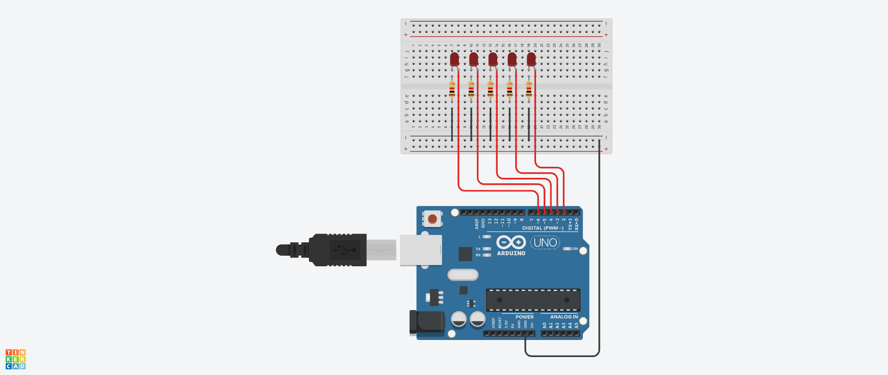

# Controlling LEDs Using Image Processing and Hand Landmark Detection

This project detects hand landmarks and controls LEDs based on the detected finger states. First, the system captures frames from a webcam and processes them using OpenCV. MediaPipe then detects the hand landmarks and draws the landmark points and their connections. The system determines whether each finger is open or closed and sends this information to the Arduino. PySerial provides serial communication between the Python script and the Arduino.

## Features
- Hand Landmark Detection
- Determining the states of fingers
- Controlling LEDs through Arduino

## Used Technologies
- Python
- OpenCV
- MediaPipe
- PySerial
- Arduino

## Requirements
- Python 3.10.11
- MediaPipe 0.10.14
- OpenCV 4.11.0
- PySerial 3.5
- Arduino
- Webcam

## Circuit Design

*Circuit designed using Autodesk Tinkercad*

## Usage
1. Assemble the circuit as shown above. (You do not need to do it exactly, you can configure it in the way you want.)
2. Upload `HardwarePart.cpp` to the Arduino.
3. Connect the Arduino and webcam to your computer.
4. Identify the Arduino's COM port and update the port name in `FingerStates.py`.
5. Close the Arduino IDE Serial Monitor to make the port available.
6. Install the required Python libraries.
7. Run `FingerStates.py`.

> CAUTION : Disconnect the Arduino from power before changing the circuit. Do not connect the circuit directly to mains electricity.